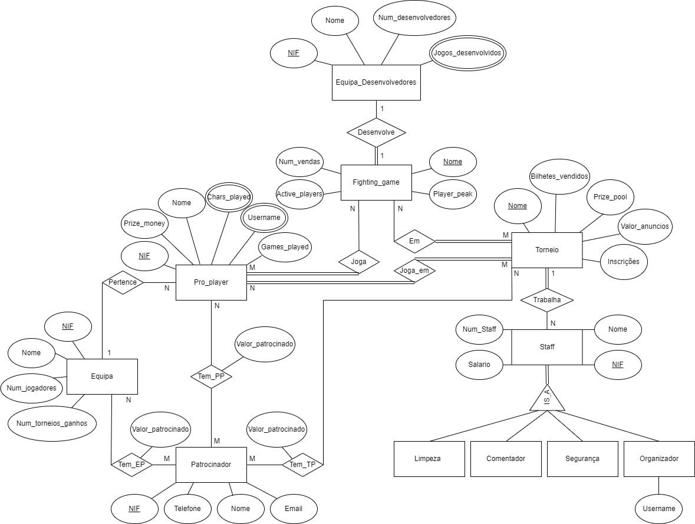
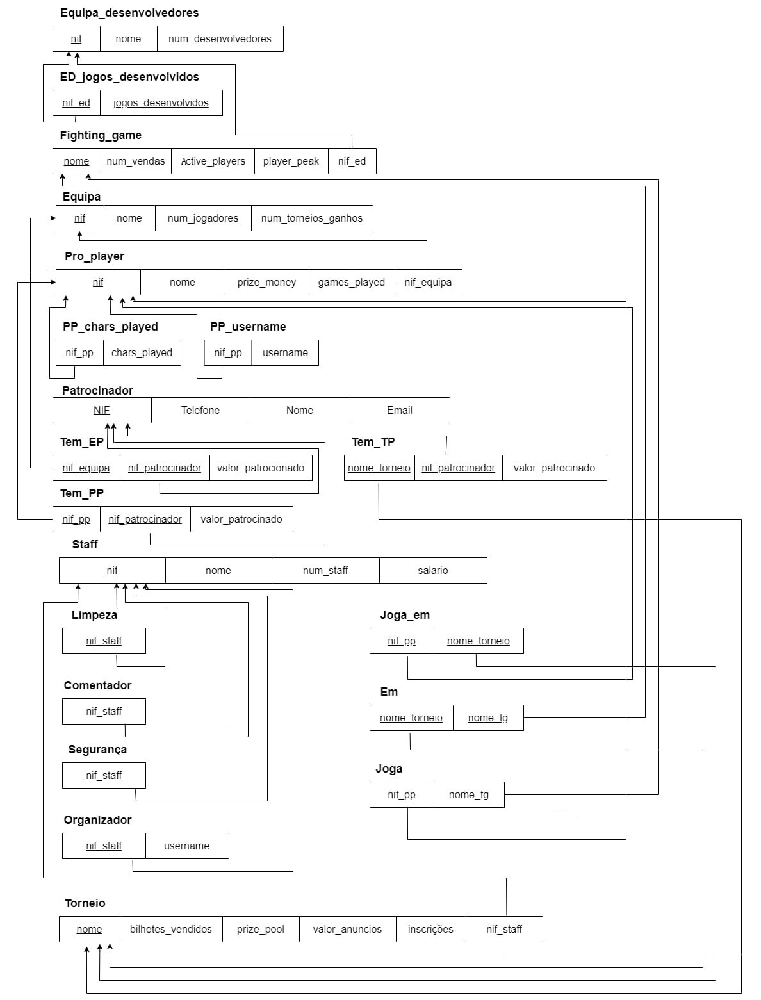
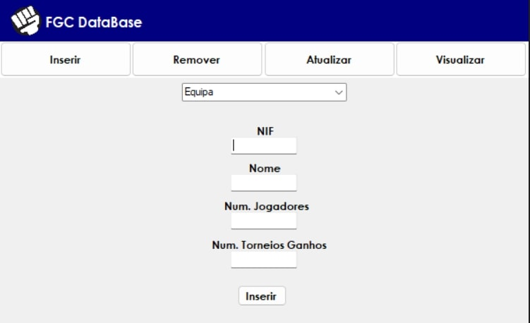
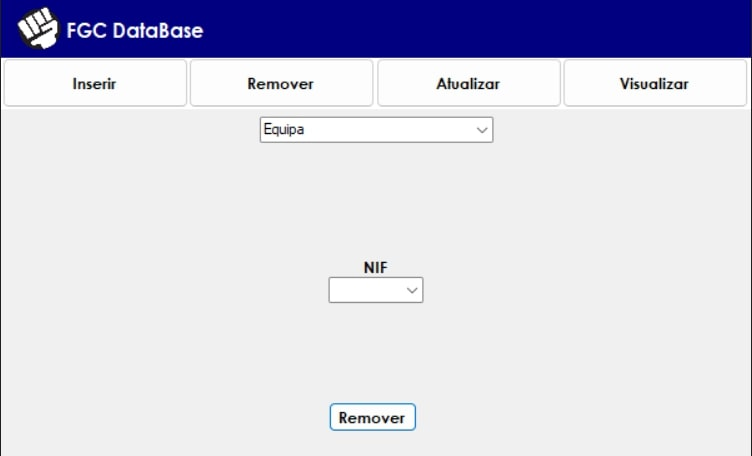
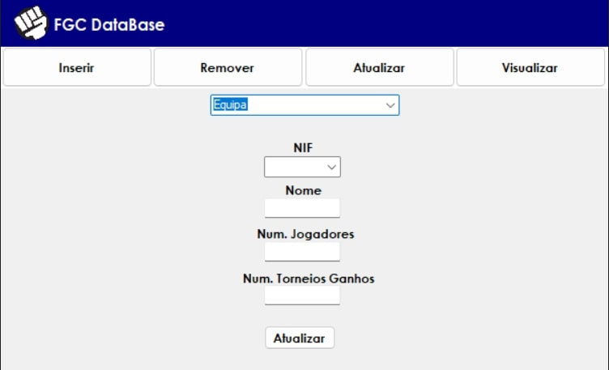
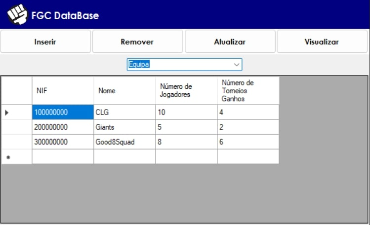

# BD: Trabalho Prático APF-T

**Grupo**: P2G3
- Gonçalo Sousa, MEC: 98152  
(João Gomes, MEC: 84754 não ajudou nesta entrega) 

## Introdução / Introduction
Base de dados de uma versão simplificada da cena competitiva de fighting games

## ​Análise de Requisitos / Requirements
Inserir/Remover e Consultar informação sobre:
- Pro_player;
- Equipas;
- Torneio;
- Patrocinadores;
- Staff do torneio:
    1. Limpeza;
    2. Comentador;
    3. Segurança;
    4. Organizador
- Fighting_game;
- Equipa_desenvolvedores;

Queries Complexas a ser feitas:
- Quantos jogadores de 1 equipa específica há num torneio
- Lucro de um Torneio (juntar anuncios e patrocinios e remover salario_staff e prize_pool)
- Ver Desenvolvedores de jogos jogados em torneios por 1 jogador especifico
- Lista de todos os patrocinadores de um torneio/equipa/pro_player
- Quantidade de pro_players a participar num torneio

## DER - Diagrama Entidade Relacionamento/Entity Relationship Diagram

### Versão final/Final version



### APFE 
Melhorias sobre a primeira entrega:

- Relação quaternária *Tem* da primeira entrega foi substituída por 3 relações binárias distintas (*Tem_EP*, *Tem_PP*, *Tem_TP*).

- Obrigatoriedade da participação nas relações corrigida:
    1. Pro_player - *Joga_em* - Torneio são totais (na 1ra entrega era só de Torneio para Pro_player);

- Adição e Alteração de atributos:
    1. Nif adicionado a pro_player e Equipa_desenvolvedores como primary key;
    2. Username, Chars_played e Jogos_desenvolvidos alterados para multivalor.

- Alteração do nome da entidade Staff_Torneio para Staff.

- Alteração da entidade fraca Torneio para uma entidade forte.

## ER - Esquema Relacional/Relational Schema

### Versão final/Final Version



### APFE
Melhorias sobre a primeira entrega:

- Alterações no Diagrama Entidade Relacionamento alteraram diretamente o respetivo Esquema Relacional.

## ​SQL DDL - Data Definition Language

[SQL DDL File](sql/01_ddl.sql "SQLFileQuestion")

## SQL DML - Data Manipulation Language

### Formulario exemplo/Example Form

  
  
  

  



```sql
-- Selecionar dados concretos
1. SELECT * FROM FGC.EquipaDesenvolvedores;
2. SELECT * FROM FGC.Equipa;
3. SELECT * FROM FGC.FightingGame;
4. SELECT * FROM FGC.Patrocinador;
5. SELECT * FROM FGC.ProPlayer;
6. SELECT * FROM FGC.Staff;
7. SELECT * FROM FGC.Torneio;

-- Inserir um elemento
1. INSERT INTO FGC.EquipaDesenvolvedores (nif, nome, num_desenvolvedores) VALUES (@nif, @nome, @nd);
2. INSERT INTO FGC.Equipa (nif, nome, num_jogadores, num_torneios_ganhos) VALUES (@nif, @nome, @nj, @ntg);
3. INSERT INTO FGC.FightingGame (nome, num_vendas, active_players, player_peak, nif_equipa_desenvolvedores) VALUES (@nome, @nv, @ap, @pp, @nifed);
4. INSERT INTO FGC.Patrocinador (nif, telefone, nome, email) VALUES (@nif, @telefone, @nome, @email);
5. INSERT INTO FGC.ProPlayer (nif, nome, prize_money, games_played, nif_equipa) VALUES (@nif, @nome, @pm, @gp, @nifeq);
6. INSERT INTO FGC.Staff (nif, nome, num_staff, salario) VALUES (@nif, @nome, @ns, @salario);
7. INSERT INTO FGC.Torneio (nome, bilhetes_vendidos, prize_pool, valor_anuncios, inscricoes, nif_staff) VALUES (@nome, @bv, @pj, @va, @inscr, @nif_staff);

-- Remover um elemento
1. DELETE FROM FGC.EquipaDesenvolvedores WHERE nif = @nif
2. DELETE FROM FGC.Equipa WHERE nif = @nif
3. DELETE FROM FGC.FightingGame WHERE nome = @nome
4. DELETE FROM FGC.Patrocinador WHERE nif = @nif
5. DELETE FROM FGC.ProPlayer WHERE nif = @nif
6. DELETE FROM FGC.Staff WHERE nif = @nif
7. DELETE FROM FGC.Torneio WHERE nome = @nome

-- Atualizar um elemento
1. UPDATE FGC.EquipaDesenvolvedores SET nome = @nome, num_desenvolvedores = @nd WHERE nif = @nif;
2. UPDATE FGC.Equipa SET nome = @nome, num_jogadores = @nj, num_torneios_ganhos = @ntg WHERE nif = @nif;
3. UPDATE FGC.FightingGame SET num_vendas = @nv, active_players = @ap, player_peak = @pp, nif_equipa_desenvolvedores = @nif_ed WHERE nome = @nome;
4. UPDATE FGC.Patrocinador SET telefone = @telefone, nome = @nome, email = @email WHERE nif = @nif;
5. UPDATE FGC.ProPlayer SET nome = @nome, prize_money = @pm, games_played = @gp, nif_equipa = @nifeq WHERE nif = @nif;
6. UPDATE FGC.Staff SET nome = @nome, num_staff = @ns, salario = @salario WHERE nif = @nif;
7. UPDATE FGC.Torneio SET bilhetes_vendidos = @bv, prize_pool = @pp, valor_anuncios = @va, inscricoes = @inscr, nif_staff = @nif_staff WHERE nome = @nome;
```

## Normalização/Normalization

Não houve minimização intencional dos dados da base de dados devido à ausência de tempo da minha parte.   
No entanto, tendo o tempo referido, teria feito uma análise das entidades e os atributos de modo a aplicar sucessivamente as formas normais, de modo a ter a 2NF ou 3NF.

## Índices/Indexes

 Criei os seguintes índices com o intuito de acelerar o acesso às chaves primárias das minhas 7 entidades.

```sql
CREATE INDEX idx_Equipa_nif ON FGC.Equipa (nif);
CREATE INDEX idx_ProPlayer_nif ON FGC.ProPlayer (nif);
CREATE INDEX idx_Patrocinador_nif ON FGC.Patrocinador (nif);
CREATE INDEX idx_Staff_nif ON FGC.Staff (nif);
CREATE INDEX idx_EquipaDesenvolvedores_nif ON FGC.EquipaDesenvolvedores(nif);
CREATE INDEX idx_FightingGame_nome ON FGC.FightingGame (nome);
CREATE INDEX idx_Torneio_nome ON FGC.Torneio (nome);
```

## SQL Programming: Stored Procedures, Triggers, UDF

[SQL SPs and Functions File](sql/02_sp_functions.sql "SQLFileQuestion")

[SQL Triggers File](sql/03_triggers.sql "SQLFileQuestion")

## Outras notas/Other notes

### Alterações realizadas pós apresentação

- Desde o dia da apresentação, o trabalho mudou completamente:  
    1. Foram implementadas algumas Queries mais complexas e todas as SPs, UDFs, Views e Triggers;
    2. Design alterado para melhorar funcionalidade.  

- Feita nova Demo para demonstrar as funcionalidades adicionadas
- Idealmente, a interface teria:
    1. Relações n-m no que diz respeito a inserir, remover, atualizar e visualizar (tempo não permitiu a implementação, pelo que funcionariam como as entidades).
    2. Login e registo para controlar a entrada na base de dados.

### Dados iniciais da base de dados/Database init data

[Inserts File](sql/04_db_init.sql "SQLFileQuestion")

### Remoção da base de dados/Database drop data

[Drop File](sql/05_drop_tables.sql "SQLFileQuestion")

### Queries Complexas da base de dados

[Queries File](sql/05_queries.sql "SQLFileQuestion")

### Views da base de dados

[Views File](sql/05_views.sql "SQLFileQuestion")  
-> 1ra e 5ta view não mostram resultados (não encontro erro)

### Índices da base de dados (apresentados na secção índices)

[Indexes File](sql/05_indexes.sql "SQLFileQuestion")


 